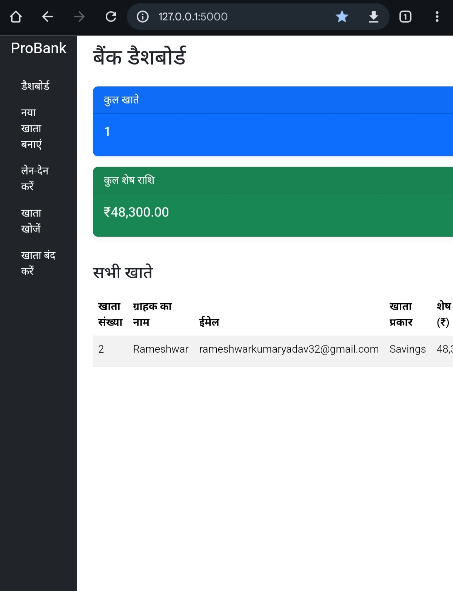

# ProBank - Bank Management Web Application

A simple yet professional web-based bank management system built using Python, Flask, and SQLite. This application allows a bank employee to create new accounts, perform transactions, view account details, and close accounts through an intuitive web interface.

---

### 🚀 Live Demo & Video Walkthrough

ें)*
-   **YouTube Video:** [**Watch Project Demo**](https://youtube.com/shorts/qTQpbjPq76U?feature=shared) 

## Key Features

-   **Professional Dashboard:** A quick overview of the total number of accounts and the total balance held by the bank.
-   **Create New Account:** Easily create new Savings or Current accounts for customers.
-   **Transactions:** Seamlessly deposit or withdraw funds from any account.
-   **Search Account:** Instantly find customer details using their unique account number.
-   **Close Account:** Securely remove an account from the system.
-   **Flash Messages:** Instant feedback for every user action (success or failure).
-   **Clean and Responsive UI:** A modern and user-friendly interface built with Bootstrap 5.

---

## Technology Stack

-   **Backend:** Python, Flask, Flask-SQLAlchemy
-   **Database:** SQLite
-   **Frontend:** HTML, CSS, Bootstrap 5

---

## Project Structure
ProBank_WebApp/
├── app.py
├── bank.db
├── readme.md
├── Review.jpg
├── requirements.txt
├── static/

└── templates/

### 🧑‍💻 Author & Connect

This project was crafted with passion by **Rameshwar Yadav**. Feel free to connect!

